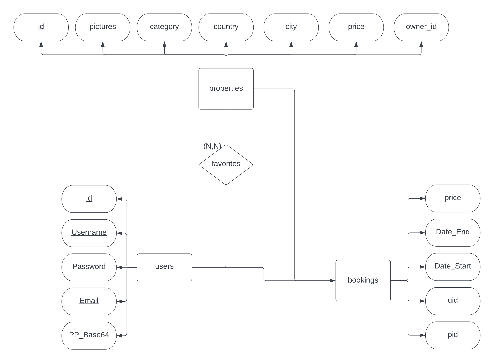
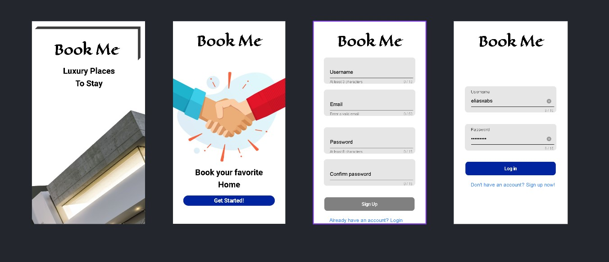

<hr>
<br>

Renting homes, or renting out homes made much easier
<br>
<br>
<h1>📚 Stack 📚</h1>

</img>
</img>
</img>
</img>


<br>
<br>
Currently, the app database is not hosted on the internet, so you will have to host it yourself.

Run the connection.php once on any hoster and you'll have the db ready
<br>
<br>

# API's used 📡
```
booking:
  post:
    addbooking
  get:
    getbooking by userid
favorite:
  post:
    addFavorite
  get:
    getfavorites by userid

property:
  post:
    addproperty
  get:
    get by userid
    get by category
    get by title
    get by country

login,signin
```


<br>
<br>

# Database 📊

Used mysql for the DataBase

ER Diagram:
<br>
<br>


</img>

<br>
<br>


# Design & Preview 🎨 
Current application design is not final changes are to be made. The design file in the repo contains the following:
- Figma file of the design
- Preview of the design (Displayed below)



<br>
<br>

# How to run the app 🏃‍♂️ 
- Download nodejs on your device
- Download ionic/cli. Run this:
```
    npm install -g @ionic/cli
```

- Check the ionic doc for more info. <a href="https://ionicframework.com/docs">Ionic Docs</a>

- Clone the repository 
```
 git clone  https://github.com/EliasXabs/BookMe.git
```

- cd into the FrontEnd file in your terminal
- Run the ionic app, Use this command:
```
    ionic serve
```

- Host the Database and the apis
- You can use xampp.

If you are using xampp, you can find the php files in the repository in the folder named "php". 
- You can copy the files to the htdocs folder in xampp and run the server.

